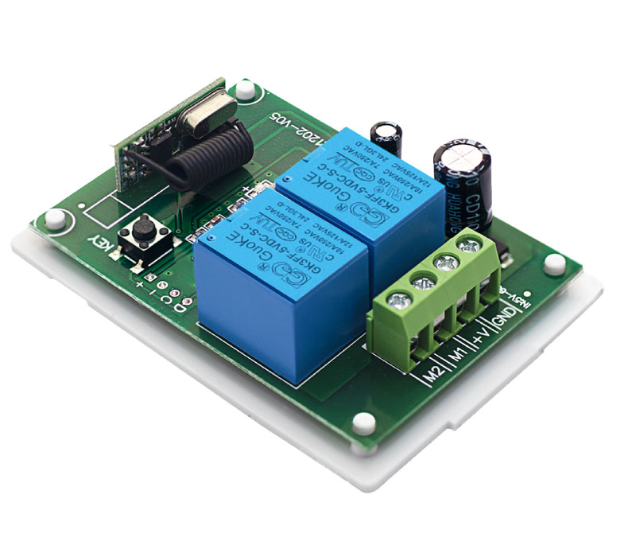
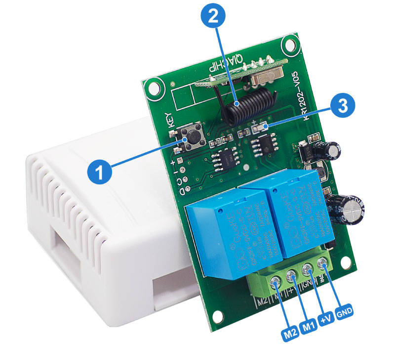
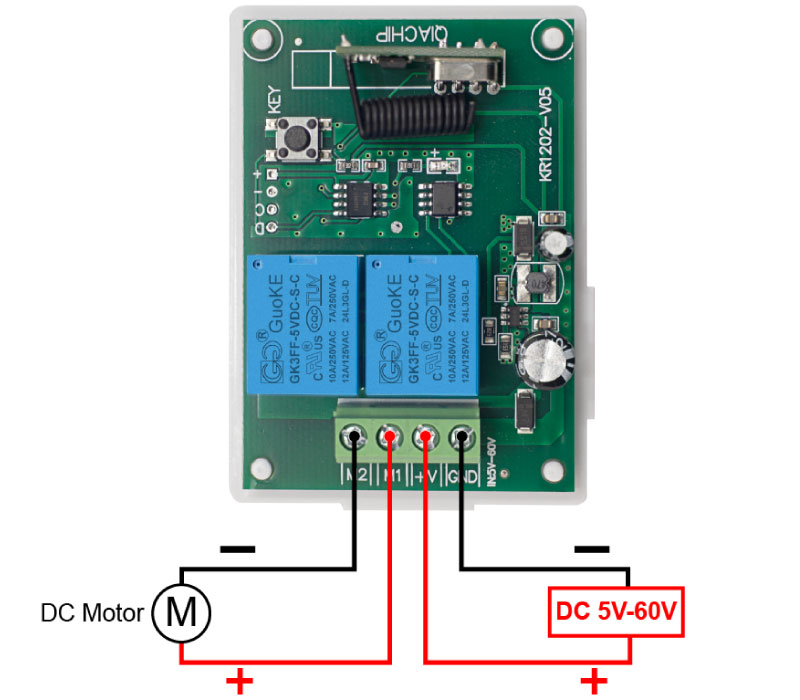

# DC Motor Forward Reverse Controller User Manual -KR1202-V05

## 1. Introduction

> Version number: V1.0
> 

> Compilation Date: 2025/4/09
> 

> **(Model: KR1202-V05)**
> 

{ width="50%" .center loading="lazy" }

## 2. Product diagram (key part markings)

{ width="50%" .center loading="lazy" }

- M1 ：Connect the motor
- M2 ：Connect the motor
- +V ：Power positive
- GND ：Power negative
- 1 : Learning Button
- 2 : Antenna
- 3 : Indicator Light

## 3. WIRING DIAGRAM

{ width="50%" .center loading="lazy" }

- M : DC Motor
- Input/Output Power ：DC 5V-60V

## 4. Function description and setting method

- Note: All the following working modes need to be implemented with QIACHIP brand remote control (transmitter) and controller (receiver / wireless remote control switch).There is no guarantee that remote controls from other brands will work properly.

### Reset function:
Clear all matched remotes. When the data is cleared, all remote control can't make receiver work.

### Settings reset:
After pressing the receiver's learning button 8 times, the receiver clears all remote control data in its memory. When the receiver's LED flashes, the reset function is complete.

### Power-off Memory Preservation
After the receiver has been set to the working mode and paired with the remote control, it will maintain this state until it is reset. The memory will not be lost due to the receiver being powered off.

### Description of the working modes:
Working modes: 1) Momentary; 2) Toggle; 3) Latching.

#### 1) Momentary mode:
After successful pairing in this mode, press and hold the remote control button (such as A), DC motor rotates forward; release the remote control button, the DC motor will turned off; press and hold the remote control button (such as B), DC motor rotates in reverse; release the remote control button, the DC motor will turned off;

Set Momentary mode :

Step 1) Press the receiver's learning button once. Wait for the LED on the receiver to light off and enter the setting state.

Step 2) Press the button on the remote control (such as A) once. The LED on the receiver will flash and then turn off.

Step 3) At this time, press another button (such as B) of the same remote control, the indicator flashes and then lights up. The jog mode is set successfully.

#### 2) Toggle mode:
After successful pairing in this mode, press the remote control button (such as A)，DC motor rotates forward; press the remote control button again, the DC motor will turned off; press the remote control button (such as B)，DC motor rotates in reverse; press the remote control button again, the DC motor will turned off;

Set Toggle Mode:

Step 1) Press the receiver's learning button twice. Wait for the LED on the receiver to light off and enter the setting state.

Step 2) Press the button on the remote control (such as A) once. The LED on the receiver will flash and then turn off.

Step 3) At this time, press another button (such as B) of the same remote control, the indicator flashes and then lights up. The jog mode is set successfully.

#### 3) Latching mode:
After successful pairing in this mode, press the remote control button(such as A), DC motor rotates forward; press the another remote control button (such as B), DC motor rotates in reverse; press the third remote control button(such as C), and the motor turns off. (This mode recommends using a three or four button remote control）

Set Latching Mode:

Step 1) Press the receiver's learning button 3 times. Wait for the LED on the receiver to light off and enter the setting state.

Step 2) Press the button on the remote control (such as A) once. The LED on the receiver will flash and then turn off.

Step 3) At this time, press another button (such as B) of the same remote control, the indicator flashes and then lights up. The jog mode is set successfully.

## 5. PRODUCT PARAMETERS

| Input Voltage | DC 5V-60V |
| --- | --- |
| RF Frequency | 433.92MHz |
| Standby Current | 8MA |
| Match Way | Learning button |
| Receiver Sensitivity | -105dBM |
| Operation Mode | Momentary Mode/Toggle Mode/Latching Mode |
| Working temperature | -10℃ ~ +80℃ |
| Size | 54mm*75mm*25mm |